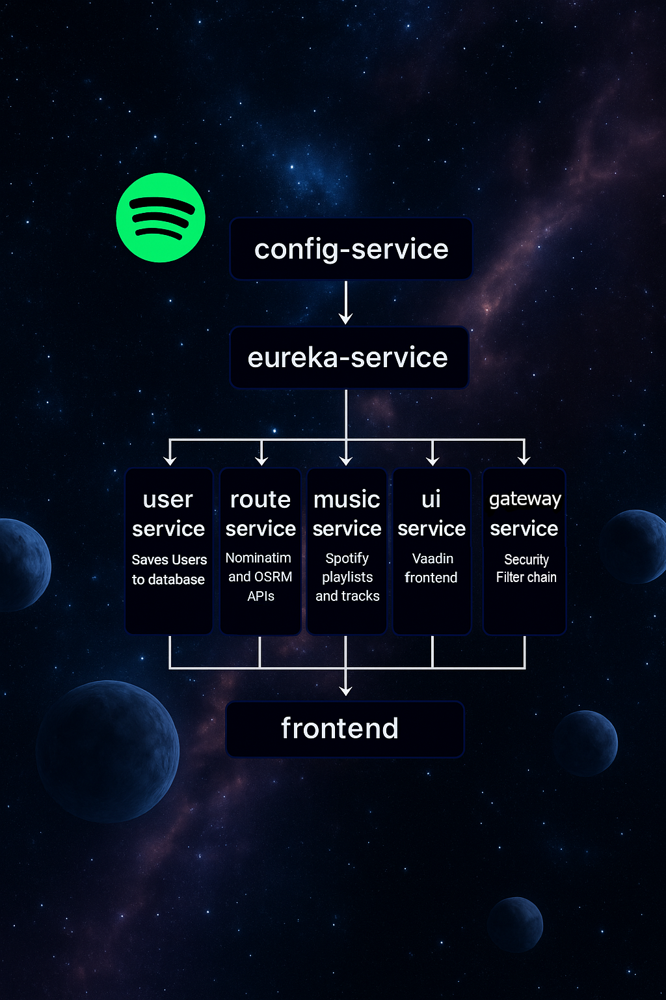

# 🚀 JourneyPlanner – Full Stack Microservice Application  
<p align="center">
  <strong>Plan smarter, travel better</strong>
</p>
An enterprise-ready travel planning platform leveraging **Vaadin**, **Spring Boot**, and **Cloud-Native Microservices** to deliver secure, scalable, and responsive travel experiences.

---

## 🧠 Executive Summary

JourneyPlanner is designed as a **distributed, containerized, cloud-ready application** that integrates **routing**, **user identity**, and **contextual music recommendations** into a cohesive, high-performance platform.

The system adopts **microservices principles** — modularity, scalability, resilience, and independent deployability.

**Primary Use Cases:**
- Plan multi-stop travel routes with real-time data.
- Associate routes with curated Spotify playlists for enhanced travel experiences.
- Support secure login via Spotify OAuth2 and JWT token propagation.
- Run in containerized environments (Docker) with central service discovery & configuration.

---

## 🌐 Architectural Principles

1. **Separation of Concerns:** Each microservice encapsulates a single domain responsibility.
2. **Centralized Service Discovery:** Enables dynamic routing and decouples service consumers from fixed endpoints.
3. **Externalized Configuration:** Ensures consistency across environments and enables zero-downtime configuration changes.
4. **Security by Design:** OAuth2 and JWT are integrated across the service mesh without role-based complexity.
5. **Resiliency:** Netflix Eureka, Spring Cloud Gateway, and container orchestration enhance uptime and fault tolerance.

---

## 🔗 Service Portfolio

| Service           | Responsibility                                                                    | Tech Highlights                                      |
|-------------------|-----------------------------------------------------------------------------------|------------------------------------------------------|
| **config<br/>service** | Spring Cloud Config Server – delivers runtime configuration to all microservices  | Config profiles: `docker`, dynamic refresh endpoints |
| **config<br/>repo**    | File storing YML config files                                                     | Branch-based environment separation                  |
| **eureka<br/>service** | Service registry for runtime service location & load balancing                    | Netflix Eureka                                       |
| **gateway<br/>service** | API Gateway – request routing, cross-cutting filters                              | Spring Cloud Gateway                                 |
| **user<br/>service**   | Manages user profiles linked with Spotify OAuth2 accounts                         | Spring Security OAuth2 Client, PostgreSQL            |
| **route<br/>service**  | Fetches and processes routes using Nominatim/OSRM APIs                            | WebClient, caching layer                       |
| **music<br/>service**  | Retrieves playlists/tracks from Spotify API                                       | Spotify Web API integration                          |
| **ui<br/>service**     | Vaadin 24 frontend, security context-aware navigation, JWT propagation            | Vaadin, Spring Security integration                  |

---

## 🧰 Technology Stack

| Layer         | Technology Choices                                                                 |
|---------------|-------------------------------------------------------------------------------------|
| **Frontend**  | 🔵 Vaadin 24 (Java-based Reactive UI)                                               |
| **Backend**   | ☕ Spring Boot 5.4.3, Spring Security, Spring Cloud                                 |
| **Auth**      | 🔐 OAuth2, JWT bearer tokens                                                        |
| **DevOps**    | 🐳 Docker, Docker Compose, Gradle                                                   |
| **Gateway**   | 🌐 Spring Cloud Gateway                                                             |
| **Discovery** | 🧭 Netflix Eureka                                                                  |
| **Database**  | 💾 PostgreSQL (containerized)                                                      |
| **Testing**   | ✅ JUnit, Mockito                                                                   |

---
## 🧙 Microservices Architecture

<p align="center">
  
</p>


---

## 🗺️ High-Level Architecture

**Interaction Flow:**
1. **UI-Service** → **Gateway-Service** → routes requests to backend services.
2. **Gateway-Service** consults **Eureka-Service** for service location.
3. All services load configuration from **Config-Service**, backed by **Config-Repo**.
4. **User-Service** uses database to save trip plans.
5. **Route-Service** uses Nominatim API, OSRM routing for location data.
6. **Music-Service** queries Spotify Web API for playlist/track data.
7. Data aggregated & returned to UI for rendering.

---

## 🔐 Security Design

- **OAuth2 Authorization Code Flow** with Spotify.
- **JWT Token** issued upon authentication.
- **Stateless Session Management**: All state encapsulated in JWT claims.
- **Logout Flow** invalidates tokens and clears relevant cookies (`jwt`, `spotify_access_token`).
- **Zero Roles Policy**: Simplified access – all authenticated users have equal privileges.

---

## 🚀 Local Development Workflow

```bash
# Build all services
./gradlew clean build

# Start the microservices environment
docker-compose up --build
```

**Access URL:**
```
http://127.0.0.1:3001/login
```

---

## 🎵 Spotify Integration

- Due to restrictions and Spotify policy, access to the application is with provided credentials or login via Apple account.
- Provided developer account for local testing:  
  ```
  Email:    accspotifyadvjourneyplaner@gmail.com
  Password: JourneyPlaner1
  ```

---

## 🖼️ Frontend Features

- **Reactive UI** powered by Vaadin 24.
- **Role-free Security**
- **Responsive Design**
- **Event-Driven Navigation** 

---

## ⚙️ Configuration & Profiles

- **Profile:** `docker` (default for Docker Compose)
- **Externalized Config:** Managed via Config-Service from Config-Repo.

---

## 📂 Repository Layout

```plaintext
JourneyPlanner/
├── config-service/
├── config-repo/
├── eureka-service/
├── gateway-service/
├── route-service/
├── music-service/
├── user-service/
├── ui-service/
├── build.gradle
├── docker-compose.yml
└── README.md
```

---

## 🧑‍💻 Maintainer

**Milosz Podsiadly**  
📧 m.podsiadly99@gmail.com  
🔗 [GitHub – MiloszPodsiadly](https://github.com/MiloszPodsiadly)  

---

## 📜 License

Licensed under the [**MIT License**](https://opensource.org/licenses/MIT).


